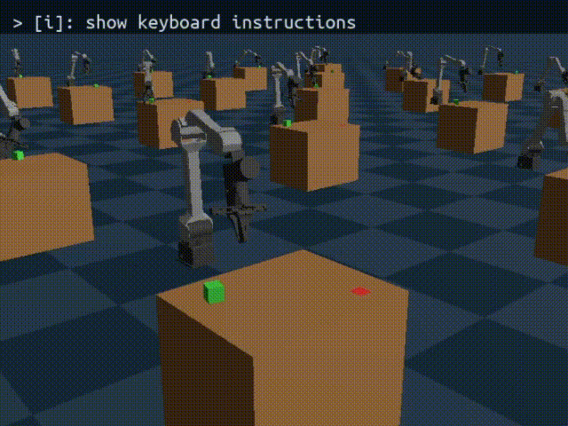

# YHRG S1 Genesis RL

[](https://www.python.org/)
[](https://github.com/Genesis-Embodied-AI/Genesis)
[](https://github.com/leggedrobotics/rsl_rl)

**Reinforcement-learning framework for non-prehensile robotic pushing with the YHRG S1 manipulator, built on the [Genesis](https://github.com/Genesis-Embodied-AI/Genesis) simulator and [rsl_rl](https://github.com/leggedrobotics/rsl_rl).**

> For more details about **YHRG S1**, please refer to the official [S1_SDK](https://github.com/YHRG-Robotics/S1_SDK).

---

## Project Description

This repository provides an end-to-end pipeline for training and evaluating a pushing policy:

- **Simulation**: A single `gs.Scene` containing a ground plane, a fixed tabletop, a fixed-base 6-DoF YHRG S1 manipulator (loaded from URDF), and one movable cuboid. The scene is replicated into a grid of parallel environments via `scene.build(n_envs=...)`.
- **Perception**: Each environment observes a point-cloud-derived centroid plus local poses of the end-effector, the cube, and the goal.
- **Policy**: A multi-layer perceptron (MLP) actor-critic trained with PPO produces an 18-dimensional action consisting of a task-space pose offset and adaptive gain commands.
- **Control**: A task-space controller converts the pose offset into joint-space targets via DLS inverse kinematics and applies adaptive PD gains.

The resulting policy learns to push the green cube to arbitrary goal positions (red rectangles) on the table. See this:



---

## Environment

Python 3.12, CUDA 12.6. Core Python dependencies:

```
genesis-world==1.1.0
rsl-rl-lib==4.0.1
torch==2.7.0+cu126
```

---

## Usage

Train:

```bash
python rl_integration.py --num_envs 4096 --max_iterations 10000
```

Evaluate the example checkpoint:

```bash
python rl_integration.py -e examples --eval --checkpoint model_9999.pt --num_envs 16 --max_iterations 1000 --vis
```

The tensorboard log of example checkpoint is available at `logs/examples`.

### Command-line arguments

| Argument | Default | Description |
|----------|---------|-------------|
| `--exp_name`, `-e` | `yhrg_s1_push` | Experiment name (defines the log/checkpoint subfolder). |
| `--num_envs`, `-B` | `16` | Number of parallel simulation environments. |
| `--max_iterations` | `13000` | PPO iterations (training) / unused in eval. |
| `--vis` | `False` | Open the Genesis viewer. |
| `--eval` | `False` | Run evaluation instead of training. |
| `--checkpoint` | `None` | Checkpoint (`*.pt`) under `log_dir/exp_name/` for evaluation. |
| `--num_episodes` | `10` | Number of evaluation episodes. |
| `--log_dir` | `logs` | Root directory for logs and checkpoints. |


---

## Project Structure

```
s1-genesis-rl/
├── rl_integration.py        # RL training/evaluation entry point (rsl_rl glue)
├── rl_push_env.py           # PushEnv: scene, observations, actions, rewards
├── config/                  # Scene/robot configuration dataclasses
├── model/                   # Robot config, loaders, point-cloud, state
├── controller/              # Task-space controller, IK solver, vision
├── view/                    # Visualization utilities
└── asset/                   # URDF / mesh / texture assets
```
---

## Acknowledgments

- **[Genesis](https://github.com/Genesis-Embodied-AI/Genesis)** — The embodied-AI world simulator that powers all physics and rendering.
- **[rsl_rl](https://github.com/leggedrobotics/rsl_rl)** — The production-grade PPO implementation used for on-policy training.
- **[pytorch3d](https://github.com/facebookresearch/pytorch3d)** — Point-cloud farthest-point sampling used for the perception centroid.
- **[shifu](https://github.com/42jaylonw/shifu)** - RL reward design.
- The **YHRG S1** manipulator hardware/URDF model.


